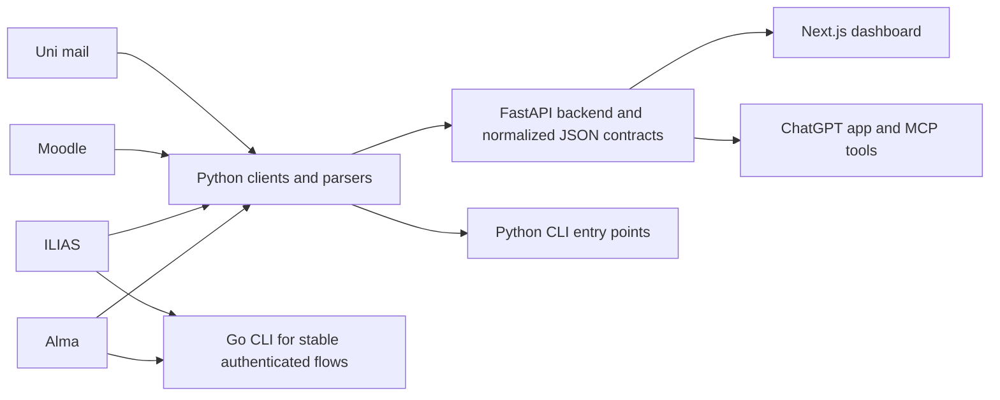
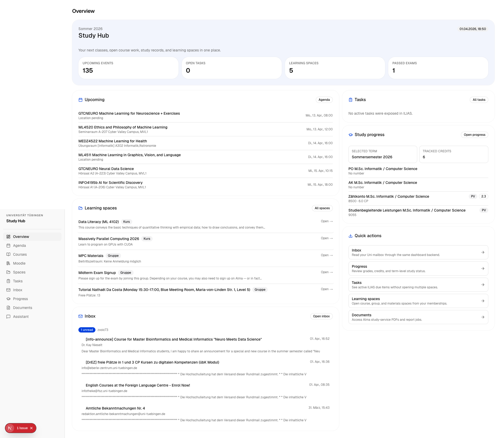
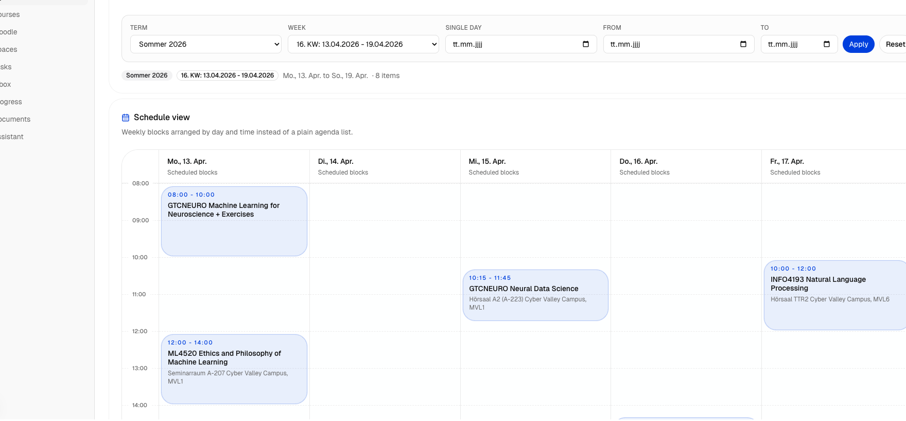

<p align="center">
  
</p>

<h1 align="center">tue-api-wrapper</h1>

<p align="center">
  Unified Alma, ILIAS, Moodle, and mail access for the University of Tuebingen.
  <br />
  One contract layer, multiple surfaces: Python API, Go CLI, Next.js dashboard, ChatGPT app, and Electron desktop.
</p>

<p align="center">
  <a href="https://github.com/SebastianBoehler/tue-api-wrapper/actions/workflows/ci.yml">
    
  </a>
  
  
  
  
  <a href="./LICENSE">
    
  </a>
</p>

<p align="center">
  <a href="#why-this-project-exists">Why</a>
  ·
  <a href="#workflow">Workflow</a>
  ·
  <a href="#quick-start">Quick Start</a>
  ·
  <a href="#desktop-app">Desktop</a>
  ·
  <a href="#repository-layout">Layout</a>
  ·
  <a href="#development">Development</a>
  ·
  <a href="#contributing">Contributing</a>
</p>

## Why this project exists

University systems often expose useful data only through brittle browser flows. This repository turns those flows into documented, testable request contracts so they can be reused in:

- local automation
- terminal tooling
- a web dashboard
- ChatGPT tools and widgets
- other student or research-facing integrations

The upstream systems remain the source of truth. This repo focuses on cleaner access, stable contracts, and better tooling around them.

## What works today

- Alma: timetable export, current lectures, exam overview, portal messages feed refresh, study-service documents, study planner parsing, public module search, and module detail fetching
- ILIAS: root navigation, memberships, task overview, content parsing, forum topics, exercise assignments, authenticated search, and info-page resolution
- Moodle: dashboard, calendar, courses, categories, grades, messages, and notifications
- Mail: read-only mailbox, inbox, and message access over IMAP
- Shared delivery surfaces: Python package, FastAPI backend, Go CLI, Next.js dashboard, ChatGPT MCP app, and Electron desktop shell

The repo is live-data oriented. When upstream authentication or university systems fail, the tools return explicit errors instead of mock data.

## Workflow



Typical development flow:

1. Discover and harden a flow in [`package/`](./package/).
2. Expose it through the FastAPI backend when it should be reusable by UI or tool surfaces.
3. Consume the same contract from the Next.js app or ChatGPT app.
4. Port especially stable Alma or ILIAS paths into [`go/`](./go/) for constrained environments.

## Surfaces

| Surface | Purpose | Entry point |
| --- | --- | --- |
| Python package | Core clients, parsers, contracts, and original CLI tools | `cd package && tue-api-server` |
| FastAPI backend | Shared JSON API for app surfaces | `http://127.0.0.1:8000/docs` |
| Go CLI | Small JSON-first CLI for stable authenticated flows | `cd go && go build ./cmd/tue` |
| Next.js app | Student-facing dashboard UI | `cd nextjs && npm run dev` |
| ChatGPT app | MCP server plus widget-based study assistant | `cd chatgpt && npm run dev` |
| Electron desktop app | Local desktop shell with encrypted credential storage and managed backend | `cd desktop && npm run dev` |

## Preview

Study hub overview:



Agenda timetable:



## Quick start

### 1. Start the Python backend

```bash
cd package
python3 -m venv .venv
source .venv/bin/activate
pip install -e .

export UNI_USERNAME="your-uni-login"
export UNI_PASSWORD="your-password"

tue-api-server
```

Default backend URL: `http://127.0.0.1:8000`

Useful endpoints:

- root: `/`
- health: `/api/health`
- OpenAPI docs: `/docs`

### 2. Start the Next.js dashboard

```bash
cd nextjs
npm ci --workspaces=false
PORTAL_API_BASE_URL=http://127.0.0.1:8000 npm run dev
```

### 3. Start the ChatGPT app

```bash
cd chatgpt
npm ci --workspaces=false
PORTAL_API_BASE_URL=http://127.0.0.1:8000 npm run dev
```

Default MCP endpoint: `http://127.0.0.1:8080/mcp`

### 4. Build the Go CLI

```bash
cd go
go build ./cmd/tue
./tue --help
```

Example commands:

```bash
./tue alma current-lectures --date 14.03.2026 --json
./tue ilias search --term graphics --json
./tue ilias info --target 5289871 --json
```

Cross-compile for Linux ARM64:

```bash
cd go
GOOS=linux GOARCH=arm64 CGO_ENABLED=0 go build -o tue-linux-arm64 ./cmd/tue
```

Note for the current macOS toolchain in this repo: plain `go build` or `go run` can fail with a missing `LC_UUID`. If you hit that locally, use the workaround documented in [`go/README.md`](./go/README.md).

## Desktop app

The desktop workspace lives in [`desktop/`](./desktop/). It wraps the existing Python backend in Electron, stores credentials with operating-system-backed encryption through Electron `safeStorage`, and exposes build plus release workflows for packaged installers.

Desktop release support now includes:

- macOS signing and notarization when the Apple certificate and notarization secrets are configured
- Windows code signing when a `.pfx` signing certificate is configured
- explicit unsigned fallback behavior for CI and for release builds that are missing signing secrets

Local development:

```bash
cd package
python3 -m venv .venv
source .venv/bin/activate
pip install -e .

cd ../desktop
npm install
npm run dev
```

Desktop packaging and release details are documented in [`desktop/README.md`](./desktop/README.md).

## Environment variables

| Variable | Required | Purpose |
| --- | --- | --- |
| `UNI_USERNAME` | Usually yes | Canonical username for Alma, ILIAS, and mail access |
| `UNI_PASSWORD` | Usually yes | Canonical password for Alma, ILIAS, and mail access |
| `MAIL_USERNAME` | Optional | Mail-only override when mailbox credentials differ |
| `MAIL_PASSWORD` | Optional | Mail-only override when mailbox credentials differ |
| `PORT` | Optional | Port for the Python backend, defaults to `8000` |
| `PORTAL_API_BASE_URL` | For Next.js and ChatGPT | Base URL of the Python backend |
| `APP_BASE_URL` | For deployed ChatGPT app | Public origin used for widget metadata and hosted app resources |

Legacy `ALMA_*` and `ILIAS_*` credential variables are still accepted for compatibility, but `UNI_USERNAME` and `UNI_PASSWORD` are the canonical setup.

## Repository layout

| Path | Purpose |
| --- | --- |
| [`package/`](./package/) | Python package, parsers, API routes, contract logic, and CLI entry points |
| [`go/`](./go/) | Native Go CLI for stable authenticated Alma and ILIAS flows |
| [`cli/`](./cli/) | Repo-local wrapper scripts around Python entry points |
| [`nextjs/`](./nextjs/) | Student dashboard built with Next.js |
| [`chatgpt/`](./chatgpt/) | ChatGPT app, MCP server, and widget UI |
| [`desktop/`](./desktop/) | Electron desktop app with onboarding, encrypted local credential storage, and sidecar backend packaging |
| [`docs/`](./docs/) | Discovery notes, screenshots, and supporting documentation |

## Development

Common checks:

```bash
cd package && python3 -m unittest discover -s tests -v
cd go && go test ./... && go build ./cmd/tue
cd nextjs && npm ci --workspaces=false && npm run check && npm run build
cd chatgpt && npm ci --workspaces=false && npm run check && npm run build
cd desktop && npm ci && npm run build
```

If you install workspace dependencies from the repository root, these convenience scripts are available:

```bash
npm run dev:web
npm run build:web
npm run dev:chatgpt
npm run build:chatgpt
npm run dev:desktop
npm run build:desktop
npm run package:desktop
```

GitHub Actions runs the same main checks on pushes to `main` and on pull requests:

- Python package install, compile, and unit tests
- Go tests and CLI build
- Next.js typecheck and production build
- ChatGPT app typecheck and production build
- Desktop renderer and Electron build in `desktop/`

Workflow file: [`.github/workflows/ci.yml`](./.github/workflows/ci.yml)

Additional desktop workflows:

- [`.github/workflows/desktop-build.yml`](./.github/workflows/desktop-build.yml): cross-platform desktop artifact builds for macOS, Windows, and Linux
- [`.github/workflows/desktop-release.yml`](./.github/workflows/desktop-release.yml): tagged desktop releases for `desktop-v*`, with macOS signing/notarization and Windows signing when secrets are available

## Related documentation

- [`package/README.md`](./package/README.md)
- [`go/README.md`](./go/README.md)
- [`chatgpt/README.md`](./chatgpt/README.md)
- [`desktop/README.md`](./desktop/README.md)
- [`cli/README.md`](./cli/README.md)
- [`docs/alma-ilias-discovery.md`](./docs/alma-ilias-discovery.md)
- [`docs/moodle-discovery.md`](./docs/moodle-discovery.md)
- [`docs/mail-discovery.md`](./docs/mail-discovery.md)
- [`docs/timms-discovery.md`](./docs/timms-discovery.md)
- [`docs/campus-logistics-discovery.md`](./docs/campus-logistics-discovery.md)

## Contributing

Contributions are welcome across parsers, contract discovery, fixtures, tests, UI, and packaging work.

Good first contribution areas:

- new Alma or ILIAS flows with tests
- parser hardening against markup drift
- docs and onboarding cleanup
- dashboard or ChatGPT UX improvements
- fixture curation and contract regression coverage

Before opening a PR, start with:

- [`CONTRIBUTING.md`](./CONTRIBUTING.md)
- [`CODE_OF_CONDUCT.md`](./CODE_OF_CONDUCT.md)
- [`SECURITY.md`](./SECURITY.md)
- [`MAINTAINERS.md`](./MAINTAINERS.md)

Small, focused pull requests with tests or fixture updates are the easiest to review.

## Security and data handling

HAR exports, cookies, signed URLs, and downloaded PDFs may contain sensitive data.

- Do not commit secrets, captures, PDFs, or live session artifacts.
- Keep private debugging material in ignored local paths only.
- Report vulnerabilities privately as described in [`SECURITY.md`](./SECURITY.md).

## License

This repository is licensed under the MIT License. See [`LICENSE`](./LICENSE).

The license applies to the code and documentation in this repository. It does not grant rights to third-party systems, trademarks, or data exposed by Alma, ILIAS, Moodle, or the University of Tuebingen.
