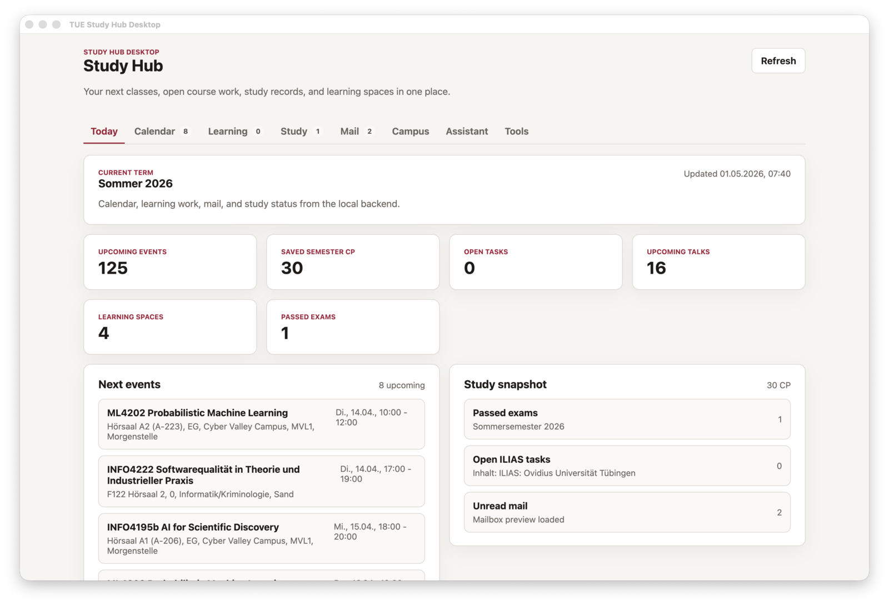
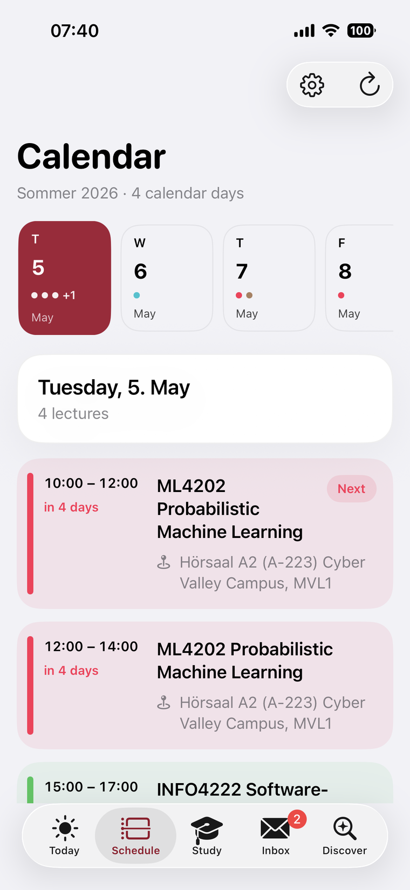
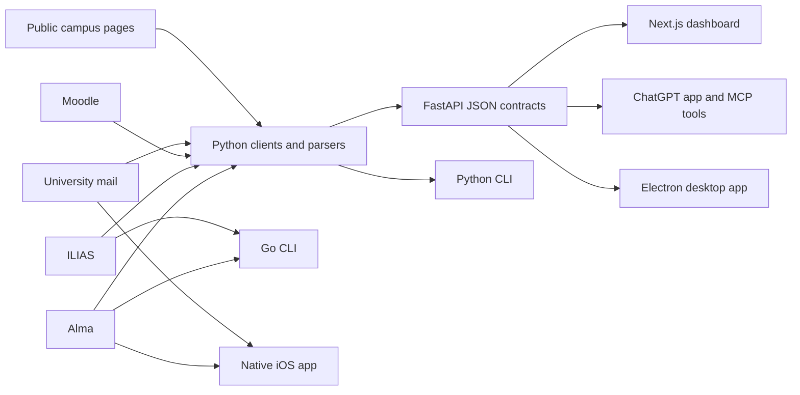

<h1 align="center">tue-api-wrapper</h1>

<p align="center">
  Request clients, parsers, and app surfaces for University of Tübingen systems.
  <br />
  Alma, ILIAS, Moodle, mail, campus data, and reusable contracts for course projects.
</p>

<p align="center">
  <a href="https://github.com/SebastianBoehler/tue-api-wrapper/actions/workflows/ci.yml">
    
  </a>
  
  
  
  
  <a href="./LICENSE">
    
  </a>
</p>

<p align="center">
  <a href="#why-this-project-exists">Why</a>
  ·
  <a href="#what-you-can-build">Build</a>
  ·
  <a href="#quick-start">Quick Start</a>
  ·
  <a href="#architecture">Architecture</a>
  ·
  <a href="#contributing">Contributing</a>
  ·
  <a href="#security-and-ethics">Security</a>
</p>

## Why this project exists

University of Tübingen study data is spread across several systems: Alma for timetables, modules, exams, and registrations; ILIAS and Moodle for learning spaces and course work; university mail for messages; and separate public pages for campus services.

Most useful data is not available through a clean public API. Students often end up scraping browser pages directly, mixing network discovery, parsing, credentials, and app logic in one fragile script. That makes projects hard to maintain, hard to test, and risky when credentials or session artifacts are involved.

This repository separates those concerns:

- clients perform the portal requests
- parsers turn HTML, JSON, ICS, and feeds into typed contracts
- API routes expose stable JSON for apps and tools
- examples show how to build web, desktop, iOS, CLI, and ChatGPT surfaces on top

The upstream university systems remain the source of truth. This project does not replace Alma, ILIAS, Moodle, or university mail; it provides a cleaner integration layer for research, teaching, and student-built tools.

## What you can build

This project is intended for practical course work and open source contributions. Useful project directions include:

- public campus tools using canteen, building, fitness, event, or public course data
- personal dashboards that combine timetable, tasks, mail, and learning spaces
- parsers that make brittle portal pages easier to consume safely
- agents or assistants that query normalized study data instead of scraping pages ad hoc
- mobile, desktop, or web clients that reuse the same backend contracts

Prefer public and unauthenticated data for course projects unless a project explicitly needs private student data. If a feature does need private data, keep credentials local to the student device or local development backend.

## Screenshots

Desktop app:



iOS app:



## Repository layout

| Path | Purpose |
| --- | --- |
| [`package/`](./package/) | Python clients, parsers, FastAPI routes, contracts, and CLI entry points |
| [`go/`](./go/) | Native Go CLI for stable Alma and ILIAS request flows |
| [`nextjs/`](./nextjs/) | Browser dashboard built with Next.js |
| [`chatgpt/`](./chatgpt/) | ChatGPT app, MCP server, and widget UI |
| [`desktop/`](./desktop/) | Electron desktop app with local credential storage and managed backend |
| [`ios/`](./ios/) | Native SwiftUI app, WidgetKit extension, and on-device clients |
| [`cli/`](./cli/) | Repo-local wrapper scripts around package entry points |
| [`docs/`](./docs/) | Discovery notes, screenshots, and supporting documentation |

## Quick start

The Python package is the best starting point for most contributors. It contains the shared request clients, parsers, API routes, and tests.

For student projects, start with the high-level SDK docs in [`docs/python-sdk.md`](./docs/python-sdk.md). For agent projects, start with the local MCP server docs in [`docs/mcp.md`](./docs/mcp.md).

### 1. Install the Python package

```bash
cd package
python3 -m venv .venv
source .venv/bin/activate
pip install -e .
```

### 2. Start the local API

```bash
tue-api-server
```

The API starts at `http://127.0.0.1:8000`.

Useful local URLs:

- API root: `http://127.0.0.1:8000/`
- health check: `http://127.0.0.1:8000/api/health`
- OpenAPI docs: `http://127.0.0.1:8000/docs`

### 3. Add credentials only when needed

Public routes should work without university credentials. Private account routes need a local university login:

```bash
export UNI_USERNAME="your-uni-login"
export UNI_PASSWORD="your-password"
```

Mail can use the same pair. If your mailbox needs separate credentials, set:

```bash
export MAIL_USERNAME="your-mail-login"
export MAIL_PASSWORD="your-mail-password"
```

Authenticated routes return explicit errors when credentials or upstream systems fail. The project should not silently switch to mock data.

### 4. Run a frontend

Next.js dashboard:

```bash
cd nextjs
npm ci --workspaces=false
PORTAL_API_BASE_URL=http://127.0.0.1:8000 npm run dev
```

ChatGPT app and MCP server:

```bash
cd chatgpt
npm ci --workspaces=false
PORTAL_API_BASE_URL=http://127.0.0.1:8000 npm run dev
```

Electron desktop app:

```bash
cd desktop
npm ci
npm run dev
```

iOS app:

```bash
npm run generate:ios
npm run build:ios
```

Go CLI:

```bash
cd go
go build ./cmd/tue
./tue --help
```

## Architecture



Typical development flow:

1. Discover the upstream request flow in `package/`.
2. Parse the response into a typed contract.
3. Add tests with fixtures or focused parser examples.
4. Expose the contract through FastAPI if apps or tools should reuse it.
5. Consume the same JSON contract from web, desktop, ChatGPT, iOS, or CLI surfaces.

## Current capabilities

- Alma: timetable export, current lectures, exam overview, portal messages, study-service documents, study planner parsing, module search, module details, and course detail bundles
- ILIAS: root navigation, memberships, task overview, content parsing, forum topics, exercise assignments, search, info-page resolution, and learning-space matching
- Moodle: dashboard, calendar, courses, categories, grades, messages, and notifications
- Mail: read-only mailbox, inbox, and message access over IMAP through the backend, plus direct on-device IMAP in iOS
- Campus: canteens, buildings, events, and fitness occupancy surfaces
- Apps: Python package, FastAPI backend, Go CLI, Next.js dashboard, ChatGPT MCP app, Electron desktop shell, and native iOS app

## Development checks

Run the checks that match the part of the repository you changed:

```bash
cd package && python3 -m unittest discover -s tests -v
cd go && go test ./... && go build ./cmd/tue
cd nextjs && npm ci --workspaces=false && npm run check && npm run build
cd chatgpt && npm ci --workspaces=false && npm run check && npm run build
cd desktop && npm ci && npm run build
npm run generate:ios && npm run build:ios
```

GitHub Actions runs the main Python, Go, Next.js, ChatGPT, desktop, and iOS checks on pushes and pull requests.

## Contributing

Contributions are welcome from students and external contributors. Good first issues usually involve one small portal flow, one parser, one endpoint, or one UI improvement.

When adding or changing integrations:

- start from the Python package unless you are working on a native-only surface
- keep credentialed flows local to a client or local backend
- prefer typed parsers and structured contracts over ad hoc string handling
- add tests for parser behavior and API contracts
- keep files focused and below 300 lines where practical
- return clear errors instead of mock data or hidden fallbacks
- avoid committing HAR files, cookies, downloaded PDFs, tokens, or session artifacts

Agent-assisted contributions are welcome. Before using an agent on this repo, point it at [`AGENTS.md`](./AGENTS.md) and ask it to preserve unrelated work, keep changes scoped, and explain verification steps.

Before opening a PR, read:

- [`CONTRIBUTING.md`](./CONTRIBUTING.md)
- [`CODE_OF_CONDUCT.md`](./CODE_OF_CONDUCT.md)
- [`SECURITY.md`](./SECURITY.md)
- [`MAINTAINERS.md`](./MAINTAINERS.md)

## Security and ethics

This project touches university systems and may handle private student data. Treat that data carefully.

- Do not commit credentials, cookies, HAR captures, signed URLs, PDFs, or mailbox exports.
- Do not build hosted services that collect other students' university passwords.
- Prefer public university pages for teaching projects when possible.
- Use private authenticated routes only with accounts you are allowed to use.
- Respect upstream rate limits, terms, and robots guidance.
- Report vulnerabilities privately as described in [`SECURITY.md`](./SECURITY.md).

## Related documentation

- [`package/README.md`](./package/README.md)
- [`docs/python-sdk.md`](./docs/python-sdk.md)
- [`docs/mcp.md`](./docs/mcp.md)
- [`go/README.md`](./go/README.md)
- [`chatgpt/README.md`](./chatgpt/README.md)
- [`desktop/README.md`](./desktop/README.md)
- [`ios/README.md`](./ios/README.md)
- [`docs/surface-parity.md`](./docs/surface-parity.md)
- [`docs/alma-ilias-discovery.md`](./docs/alma-ilias-discovery.md)
- [`docs/moodle-discovery.md`](./docs/moodle-discovery.md)
- [`docs/mail-discovery.md`](./docs/mail-discovery.md)
- [`docs/campus-logistics-discovery.md`](./docs/campus-logistics-discovery.md)

## License

This repository is licensed under the Apache License 2.0. See [`LICENSE`](./LICENSE).

Versions first distributed before April 28, 2026 remain available under the licenses they were originally published under, including MIT and Business Source License 1.1 where applicable.

The license applies to the code and documentation in this repository. It does not grant rights to third-party systems, trademarks, or data exposed by Alma, ILIAS, Moodle, or the University of Tübingen.
