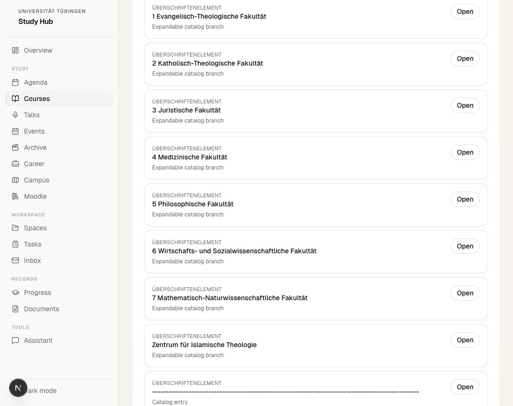

[](https://github.com/SebastianBoehler/tue-api-wrapper/actions/workflows/ci.yml)


# tue-api-wrapper

Unified Alma + ILIAS access for the University of Tuebingen.

This repository packages the same core contracts in multiple surfaces:

- a reusable Python client and FastAPI backend
- a Unix-native Go CLI for constrained environments
- a Next.js student dashboard
- a ChatGPT Apps SDK MCP server and widget

The goal is to keep Alma and ILIAS as the source of truth while building cleaner access layers, better search, and more maintainable tooling around them.

## Preview



## Why this repo exists

University systems often expose useful workflows only through brittle browser flows. This project turns those flows into documented, testable request contracts so they can be reused by:

- dashboards
- CLI tools
- local automations
- ChatGPT tools
- other student or research tooling

## What works today

- Alma timetable exports without browser automation
- Alma study-service document discovery
- Alma authenticated current-lectures listing
- ILIAS repository root and content parsing
- ILIAS authenticated search
- ILIAS info-screen resolution
- shared JSON-friendly contracts across Python and Go

## Repository structure

| Path | Purpose |
| --- | --- |
| `package/` | Python package, request-based Alma/ILIAS clients, FastAPI backend |
| `go/` | JSON-first Go CLI for stable authenticated flows |
| `cli/` | Repo-local shell wrappers around Python entry points |
| `nextjs/` | Student-facing web app |
| `chatgpt/` | ChatGPT app with MCP tools and widget UI |

## Quick start

### Backend

```bash
cd package
python3 -m venv .venv
source .venv/bin/activate
pip install -e .

export UNI_USERNAME="your-uni-login"
export UNI_PASSWORD="your-password"

tue-api-server
```

Default URL: `http://127.0.0.1:8000`

### Web app

```bash
cd nextjs
npm ci --workspaces=false
PORTAL_API_BASE_URL=http://127.0.0.1:8000 npm run dev
```

### Go CLI

```bash
cd go
go build ./cmd/tue
./tue --help
```

Example commands:

```bash
./tue alma current-lectures --date 14.03.2026 --json
./tue ilias search --term graphics --json
./tue ilias info --target 5289871 --json
```

Cross-compile for a Linux ARM64 board:

```bash
cd go
GOOS=linux GOARCH=arm64 CGO_ENABLED=0 go build -o tue-linux-arm64 ./cmd/tue
```

### ChatGPT app

```bash
cd chatgpt
npm ci --workspaces=false
PORTAL_API_BASE_URL=http://127.0.0.1:8000 npm run build
PORTAL_API_BASE_URL=http://127.0.0.1:8000 npm run dev
```

Default MCP URL: `http://127.0.0.1:8080/mcp`

## Contributing

Contributions are welcome across parsers, contract discovery, tests, docs, UI, and packaging.

Good contribution areas:

- new authenticated Alma or ILIAS endpoints
- parser hardening against real markup drift
- fixture-based contract tests
- dashboard improvements
- CLI ergonomics
- packaging and deployment work

Start with:

- [`CONTRIBUTING.md`](./CONTRIBUTING.md)
- [`CODE_OF_CONDUCT.md`](./CODE_OF_CONDUCT.md)
- [`SECURITY.md`](./SECURITY.md)
- [`MAINTAINERS.md`](./MAINTAINERS.md)

If you want to open a PR, small scoped changes with tests or fixture updates are the easiest to review.

## Maintainers Wanted

This repository is intentionally becoming easier to maintain in public. Help is especially useful in:

- Go client expansion beyond the initial stable flows
- CI hardening across Python, Go, and frontend packages
- docs and onboarding cleanup
- fixture curation and parser regression coverage
- UI improvements for the student dashboard and ChatGPT app

If you want to become a regular reviewer or maintainer, see [`MAINTAINERS.md`](./MAINTAINERS.md).

## CI

GitHub Actions currently validates:

- Python package install, compile, and tests in `package/`
- Go CLI build and tests in `go/`
- Next.js typecheck and production build in `nextjs/`
- ChatGPT app typecheck and production build in `chatgpt/`

Workflow file: [`.github/workflows/ci.yml`](./.github/workflows/ci.yml)

## Security and data handling

Captured HAR exports, cookies, signed URLs, and downloaded PDFs may contain sensitive material.

- do not commit secrets, HAR captures, PDFs, or live session artifacts
- keep private debugging fixtures under ignored local paths only
- report vulnerabilities privately as described in [`SECURITY.md`](./SECURITY.md)

## License

This repository is licensed under the MIT License. See [`LICENSE`](./LICENSE).

The license applies to the code and documentation in this repository. It does not grant rights to third-party systems, trademarks, or data exposed by Alma, ILIAS, or the University of Tuebingen.

## Related docs

- [`package/README.md`](./package/README.md)
- [`go/README.md`](./go/README.md)
- [`chatgpt/README.md`](./chatgpt/README.md)
- [`CONTRIBUTING.md`](./CONTRIBUTING.md)
