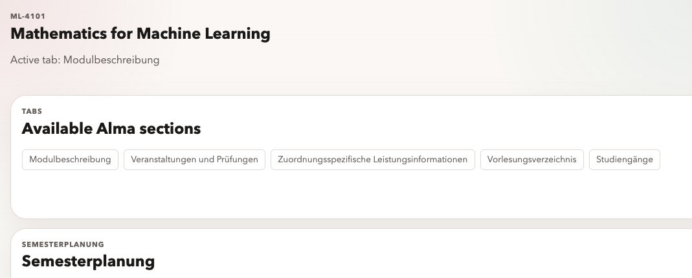

# ChatGPT App

This folder contains a ChatGPT Apps SDK scaffold for the unified Alma + ILIAS study hub, including dashboard widgets and public Alma detail rendering.

## Preview

The current widget bundle rendering a public Alma module detail:



## Tool surface

- `search`: standard read-only search for unified portal items
- `fetch`: standard read-only fetch by item id
- `get_study_snapshot`: combined status for upcoming schedule, tasks, grades, and spaces
- `get_upcoming_schedule`: Alma timetable view for next lectures or meetings
- `get_current_tasks`: ILIAS derived task overview
- `get_current_grades`: Alma exam rows plus tracked credits and passed exam count
- `get_learning_spaces`: authenticated ILIAS memberships
- `get_documents_summary`: Alma study-service summary with tabs, output requests, and current PDF availability
- `get_mail_inbox`: inbox triage and filtering inside ChatGPT
- `get_mail_message`: full plaintext mail message detail by UID
- `get_course_catalog_filters`: valid Alma public module-search filters for degree, subject, faculty, language, and element type
- `search_courses`: public Alma module-description search
- `search_course_offerings`: authenticated Alma course search for term-specific offerings
- `get_course_detail`: structured Alma course or module detail for a known detail URL
- `get_study_planner`: Alma semester grid and visible planner modules
- `search_learning_spaces`: authenticated ILIAS search
- `inspect_learning_space`: content, forum, and exercise summary for a specific ILIAS space
- `show_dashboard`: widget-backed study overview
- `list_documents`: widget-backed Alma study-service document list

The widget uses the MCP Apps bridge for tool-result updates and only falls back to `window.openai.sendFollowUpMessage(...)` for optional follow-up messaging. The data tools are designed so ChatGPT can answer questions like:

- "What are my next lectures or meetings?"
- "What tasks are due soon?"
- "What are my current grades and credits?"
- "Which learning spaces am I enrolled in?"
- "What courses fit my degree or subject next semester?"
- "What mail needs my attention today?"
- "What document job do I need for my enrollment certificate?"
- "What does this ILIAS space currently contain?"

The widget also uses ChatGPT host capabilities when available:

- `window.openai.callTool(...)` for in-widget panel refreshes without remounting the widget
- `window.openai.setWidgetState(...)` to persist the active panel, course query, and selected detail
- `window.openai.requestModal(...)` to open host-owned detail views
- `window.openai.requestDisplayMode(...)` for fullscreen expansion
- `window.openai.requestClose()` inside the modal detail view

## Development

```bash
npm install
npm run build
npm run dev
```

The server listens on `http://localhost:8080/mcp` by default.

Set `PORTAL_API_BASE_URL` to point at the Python backend in `../package`. The app is live-data only and returns explicit backend errors when that API is not reachable.

## Auth and deployment

This app does not implement Apps SDK OAuth yet. All private university data tools are therefore legacy/dev-authenticated through the Python backend, not production multi-user authentication.

For now, the only supported private-data deployment model is single-user development:

- deploy the Python backend with `UNI_USERNAME` and `UNI_PASSWORD` set in the backend environment
- point `PORTAL_API_BASE_URL` at that private backend
- keep the ChatGPT app deployment private to your own setup rather than exposing it as a broadly shared public app

Do not use this model for multiple students. The backend credentials represent one account, and ChatGPT widget state, browser storage, and cookies must not store university passwords.

Production ChatGPT auth should use Apps SDK OAuth with protected resource metadata, PKCE-capable authorization, bearer-token verification on each MCP request, and per-tool scope checks. If private university portal access is still needed there, credentials belong in an explicit server-side encrypted account-linking vault keyed by the authenticated user, not in widget storage.

Typical local setup:

```bash
cd ../package
UNI_USERNAME=... UNI_PASSWORD=... PORT=8001 PYTHONPATH=src python -m tue_api_wrapper.api_server

cd ../chatgpt
PORTAL_API_BASE_URL=http://127.0.0.1:8001 npm run dev
```

Health check:

```bash
curl http://localhost:8080/healthz
```

## Cloud Run

The server is already an Apps SDK / MCP server. On Cloud Run, the public connector URL is:

```text
https://YOUR_SERVICE_URL/mcp
```

Use the Cloud Run service origin itself as `APP_BASE_URL`. This keeps the widget metadata aligned with the deployed host origin, which is important for app submission and iframe loading.

Build the container manually:

```bash
docker build -t gcr.io/PROJECT_ID/tue-study-hub-chatgpt .
```

Deploy the container manually:

```bash
gcloud run deploy tue-study-hub-chatgpt \
  --image gcr.io/PROJECT_ID/tue-study-hub-chatgpt \
  --region europe-west3 \
  --allow-unauthenticated \
  --set-env-vars PORTAL_API_BASE_URL=https://your-backend.example.com
```

`--allow-unauthenticated` keeps the MCP endpoint reachable by ChatGPT. Without Apps SDK OAuth, "private" here means a private ChatGPT app configuration and a legacy/dev backend that uses your own env-backed university credentials, not production multi-user auth or a connector endpoint that is network-inaccessible to OpenAI.

Then update the service so `APP_BASE_URL` matches the Cloud Run URL that was assigned:

```bash
gcloud run services update tue-study-hub-chatgpt \
  --region europe-west3 \
  --update-env-vars APP_BASE_URL=https://YOUR_SERVICE_URL
```

Or use the included helper, which builds, deploys, reads the resulting Cloud Run URL, and then writes it back into `APP_BASE_URL` automatically:

```bash
./scripts/deploy-cloud-run.sh PROJECT_ID europe-west3 \
  gcr.io/PROJECT_ID/tue-study-hub-chatgpt \
  https://your-backend.example.com
```

If you prefer declarative deployment, edit the placeholders in [cloudrun.service.yaml](/Users/sebastianboehler/Documents/GitHub/tue-api-wrapper/chatgpt/cloudrun.service.yaml) and apply it with `gcloud run services replace`.

Cloud Build is also included:

```bash
gcloud builds submit --config cloudbuild.yaml --substitutions _IMAGE=gcr.io/PROJECT_ID/tue-study-hub-chatgpt
```

After deployment, verify:

```bash
curl https://YOUR_SERVICE_URL/healthz
curl https://YOUR_SERVICE_URL/
```

Expected endpoints:

- root: `/`
- health: `/healthz`
- MCP connector: `/mcp`
